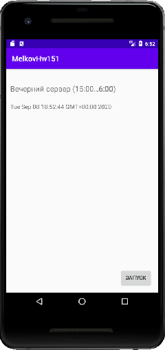

## Задача 1. Синхронизация данных
### Задание:

Мы уже умеем пользоваться явными намерениями. Неявные намерения понадобятся нам при работе в команде (когда мы не знаем, какой именно экран будет написан другим членом команды для нас), либо для разных реализаций одного и того же действия.

Нам необходимо реализовать механизм синхронизации данных с сервером в сложном клиент-серверном приложении.

Для системы выделено 3 сервера:
- http://morning - для получения данных после ночной обработки;
- http://afternoon - для обновления справочников днём;
- http://evening - для получения данных, обработанных до обеда.
Необходимо для каждого сервера реализовать свою Activity и назвать соответствующим названием. На каждом экране подписать название, вывести текущее время в текстовое поле и добавить кнопку "Запуск" для запуска синхронизации.

На главной Activity сделать кнопку "Синхронизация", которая в зависимости от времени суток будет вызывать ту или иную синхронизацию.

Правило синхронизации:

с 6-00 до 14-00: утренняя, с 14 до 15: дневная, с 15 до 6: вечерняя.

### Выполнение

1. Создадим главную Activity и назовём её MainActivity, на ней расположим кнопку "Синхронизация".
2. В обработчике кнопки нужно добавить проверку на текущее время и вызов синхронизации через неявный Intent:

```
Intent intent = new Intent(Intent.ACTION_SYNC);

//вставьте обработку условий по времени
if (/*текущее время с 6:00 до 14:00*/)
intent.setData(Uri.parse("http://morning"));
// следующее условие
...
startActivity(intent);
```
3. Создать новые 3 Activity в соотвествии с временем суток: MorningActivity, ...
4. Теперь нужно добиться, чтобы в зависимости от получаемых значений открывалась нужная Activity, для этого нужно в файле Манифеста внести следующие изменения:
- В файле манифеста нужно найти описание трёх Activity для синхронизации, например, MorningActivity, описание будет выглядеть примерно так:
```
<activity android:name=".MorningActivity">
</activity>
```

Нам нужно добавить секцию фильтров:
```
<activity android:name=".MorningActivity">
   <intent-filter>
   </intent-filter>
</activity>
```
- После этого надо добавить необходимые фильтры для того чтобы по действию SYNC была найдена наша Activity. Должно получиться примерно так:
```
<activity android:name=".MorningActivity">
    <intent-filter>
        <action android:name="android.intent.action.SYNC"/>
        <category android:name="android.intent.category.DEFAULT"/>
        <category android:name="android.intent.category.BROWSABLE"/>
        <data android:scheme="http" android:host="morning"/>
    </intent-filter>
</activity>
```
- Аналогичные действия проделываем для двух других Activity, отвечающих за запуск синхронизации, не забываем менять в элементе <data ... /> значение android:host, которое будет соответствовать определенному серверу синхронизации.

